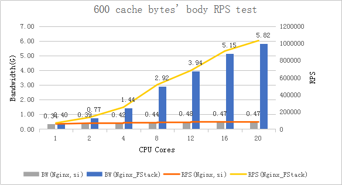
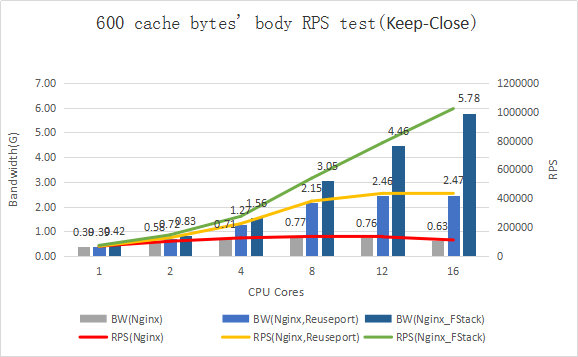
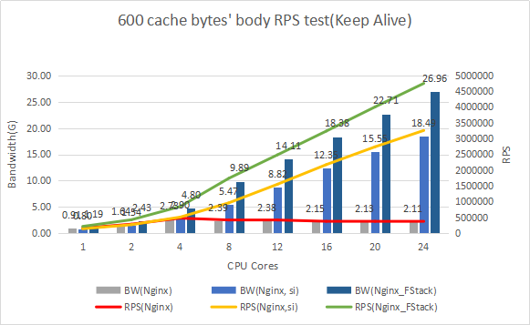
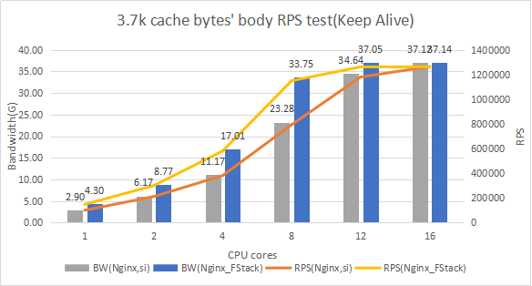

    # clone F-Stack
    mkdir -p /data/f-stack
    git clone https://github.com/F-Stack/f-stack.git /data/f-stack

    # Install libnuma-dev
    yum install numactl-devel          # on Centos
    #sudo apt-get install libnuma-dev  # on Ubuntu

    cd f-stack
    # Compile DPDK
    cd dpdk/usertools
    ./dpdk-setup.sh # compile with x86_64-native-linuxapp-gcc

    # Set hugepage
    # single-node system
    echo 1024 > /sys/kernel/mm/hugepages/hugepages-2048kB/nr_hugepages

    # or NUMA
    echo 1024 > /sys/devices/system/node/node0/hugepages/hugepages-2048kB/nr_hugepages
    echo 1024 > /sys/devices/system/node/node1/hugepages/hugepages-2048kB/nr_hugepages

    # Using Hugepage with the DPDK
    mkdir /mnt/huge
    mount -t hugetlbfs nodev /mnt/huge

    # Close ASLR; it is necessary in multiple process
    echo 0 > /proc/sys/kernel/randomize_va_space

    # Install python for running DPDK python scripts
    sudo apt install python # On ubuntu
    
    # Offload NIC
    modprobe uio
    insmod /data/f-stack/dpdk/x86_64-native-linuxapp-gcc/kmod/igb_uio.ko
    insmod /data/f-stack/dpdk/x86_64-native-linuxapp-gcc/kmod/rte_kni.ko carrier=on # carrier=on is necessary, otherwise need to be up `veth0` via `echo 1 > /sys/class/net/veth0/carrier`
    python dpdk-devbind.py --status
    ifconfig eth0 down
    python dpdk-devbind.py --bind=igb_uio eth0 # assuming that use 10GE NIC and eth0

    # Install DPDK
    cd ../x86_64-native-linuxapp-gcc
    make install

    # On Ubuntu, use gawk instead of the default mawk.
    #sudo apt-get install gawk  # or execute `sudo update-alternatives --config awk` to choose gawk.

    # Install dependencies for F-Stack
    sudo apt install gcc make libssl-dev # On ubuntu
 
    # Compile F-Stack
    export FF_PATH=/data/f-stack
    export FF_DPDK=/data/f-stack/dpdk/x86_64-native-linuxapp-gcc
    cd ../../lib/
    make

    # Install F-STACK
    # libfstack.a will be installed to /usr/local/lib
    # ff_*.h will be installed to /usr/local/include
    # start.sh will be installed to /usr/local/bin/ff_start
    # config.ini will be installed to /etc/f-stack.conf
    make install

#### Nginx

    cd app/nginx-1.16.1
    bash ./configure --prefix=/usr/local/nginx_fstack --with-ff_module
    make
    make install
    cd ../..
    /usr/local/nginx_fstack/sbin/nginx

for more details, see [nginx guide](https://github.com/F-Stack/f-stack/blob/master/doc/F-Stack_Nginx_APP_Guide.md).

#### Redis

    cd app/redis-5.0.5/
    make
    make install

  If KNI is enabled in the configuration file, you should create a virtual NIC after F-Stack started, and set the ipaddr, netmask, mac addr, route table, etc. These addrs must be same with F-Stack.

  If you don't have another management port, you should execute a script like this.

    /usr/local/nginx_fstack/sbin/nginx
    sleep 10
    ifconfig veth0 <ipaddr>  netmask <netmask>  broadcast <broadcast> hw ether <mac addr>
    route add -net 0.0.0.0 gw <gateway> dev veth0
    echo 1 > /sys/class/net/veth0/carrier # if `carrier=on` not set while `insmod rte_kni.ko` 
    # route add -net ...  # other route rules

## Binary Release

We provide a  f-stack-binary-release package that you can use F-Stack directly without compiling. For more details, see [Binary_Release_Quick_Start](https://github.com/F-Stack/f-stack/blob/master/doc/F-Stack_Binary_Release_Quick_Start.md).

## Nginx Testing Result

Test environment

    NIC:Intel Corporation Ethernet Controller XL710 for 40GbE QSFP+
    CPU:Intel(R) Xeon(R) CPU E5-2670 v3 @ 2.30GHz(NUMA)
    Memory：128G
    OS:CentOS Linux release 7.2 (Final)
    Kernel：3.10.104-1-tlinux2-0041.tl2

Nginx uses linux kernel's default config, all soft interrupts are working in the first CPU core.

Nginx si means modify the smp_affinity of every IRQ, so that the decision to service an interrupt with a particular CPU is made at the hardware level, with no intervention from the kernel.

Nginx Reuseport means enable "reuseport" in `nginx.conf`.

Nginx_FStack's 600 cache bytes' body was returned directly in nginx.conf.

All of these test cases use CPUs' physical cores.

CPS (Connection:close, Small data packet)  test result

CPS_Reuseport (Connection:close, Small data packet)  test result, This test case runs in a different test environment

RPS (Connection:Keep-Alive, Small data packet) test data

Bandwidth (Connection:Keep-Alive, 3.7k bytes data packet) test data

2021.01.29
complete easy udp/tcp compatibility function
code road /f-stack/app/LD_PRELOAD
